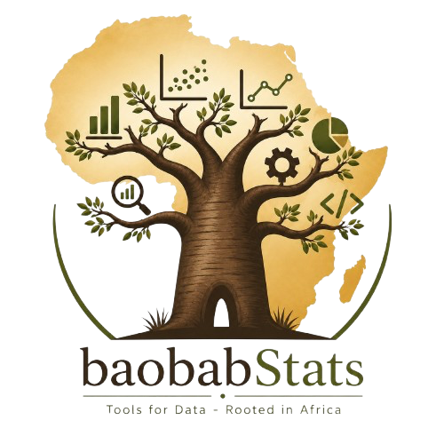

<p align="center">
  
</p>

<h1 align="center">baobabStats</h1>

<p align="center">
  <em>Tools for Data — Rooted in Africa</em><br>
  Une boîte à outils R pour analyser les recensements et les enquêtes, pensée pour l'Afrique.
</p>

<p align="center">
  
  
  
  
</p>

---

## En deux mots

Produire les tableaux, les indicateurs et les rapports d'un recensement, c'est un travail long, répétitif et exigeant. Il faut nettoyer des millions de lignes, calculer des dizaines d'indicateurs démographiques selon les normes internationales, contrôler la qualité des données, puis tout mettre en forme dans des documents officiels.

**baobabStats** rassemble tout ce cycle dans un seul package R, en français, conçu pour les instituts nationaux de statistique et les démographes du continent. Vous décrivez votre projet dans un simple fichier Excel ; le package se charge du reste — de la lecture des données jusqu'aux rapports en Word, Excel et HTML.

Le nom n'est pas un hasard : comme le baobab, l'outil est robuste, enraciné dans son territoire, et conçu pour durer.

---

## Ce que baobabStats sait faire

- **Lire vos données** quelle que soit leur origine : CSV, Excel, SPSS, Stata, mais aussi CSPro, KoboToolbox et ODK, les outils de collecte les plus courants sur le terrain.
- **Nettoyer et harmoniser** : imputation des valeurs manquantes, détection des doublons, correction automatique des libellés de régions mal orthographiés.
- **Contrôler la qualité** des déclarations d'âge (indices de Whipple, Myers, Bachi) et comparer recensement et enquête post-censitaire pour estimer les taux d'omission et les coefficients de redressement.
- **Calculer les indicateurs démographiques** de référence : pyramide des âges, indice synthétique de fécondité, tables de mortalité, espérance de vie, rapports de dépendance, et bien d'autres.
- **Projeter la population** par la méthode des cohortes-composantes, celle qu'utilisent les Nations Unies dans leurs *World Population Prospects*.
- **Estimer sur petits domaines** (small area estimation) pour descendre au niveau de l'arrondissement, avec désagrégation par âge, sexe et handicap.
- **Cartographier** vos indicateurs sur des cartes thématiques.
- **Générer les rapports** des 14 grandes thématiques d'un recensement, chacun en Word, Excel et HTML, avec une interprétation rédigée automatiquement.

Le tout repose sur trois moteurs d'analyse unifiés sous une seule interface cohérente.

---

## Installation

baobabStats est un package R pur : aucune compilation n'est nécessaire.

```r
# Depuis l'archive source
install.packages("baobabStats_1.1.1.tar.gz", repos = NULL, type = "source")

# Dépendances recommandées
install.packages(c(
  "dplyr", "tibble", "cli", "ggplot2", "readxl", "openxlsx",
  "officer", "data.table", "sf"
))

library(baobabStats)
```

> **Conseil** — Installez `data.table` et `sf`. Le premier accélère considérablement le traitement des gros fichiers (un recensement compte souvent plusieurs millions de lignes) ; le second active les cartes thématiques. Sans eux, le package fonctionne quand même, simplement en mode plus lent et sans cartographie.

---

## Premiers pas

Le plus simple est de partir d'un fichier de configuration Excel. Vous le remplissez une fois, puis tout s'enchaîne.

```r
library(baobabStats)

# 1. Créer le classeur de configuration
bs_config_modele("config_rgph.xlsx")

# 2. Ouvrir le fichier dans Excel, indiquer le chemin de vos données
#    et faire correspondre vos colonnes (onglet "Variables").

# 3. Lancer tout le pipeline
resultats <- bs_pipeline("config_rgph.xlsx")
```

En une commande, baobabStats parcourt sept étapes — collecte, nettoyage, contrôle qualité, tabulations, visualisations, diffusion, puis rapports thématiques — et dépose tous les livrables dans votre dossier de sortie.

Vous préférez travailler fonction par fonction ? C'est tout aussi possible :

```r
individus <- bs_collecter("individus.csv")

# Qualité des déclarations d'âge
q <- bs_qualite_intrinseque(individus, var_age = "age", var_sexe = "sexe")
bs_interpreter(q)        # une interprétation rédigée en français

# Indice synthétique de fécondité
isf <- bs_isf(individus, age_mere_var = "age", sex_var = "sexe")

# Un rapport thématique complet
bs_rapport_thematique(individus, theme = "education",
                      formats = c("word", "html"))
```

---

## La configuration par Excel, sans écrire de code

C'est le cœur de la philosophie du package : un statisticien doit pouvoir piloter une chaîne de production sans être programmeur. Le classeur de configuration comporte des onglets clairs, chacun correspondant à une étape :

| Onglet | À quoi il sert |
|---|---|
| **Projet** | Nom, pays, année, dossier de sortie |
| **Collecte** | Où se trouvent vos données et dans quel format |
| **Variables** | Faire correspondre chaque rôle (âge, sexe, région…) à vos colonnes |
| **Qualité** / **Backcheck** | Contrôles de cohérence et concordance post-censitaire |
| **Cartographie** | Dossier du fond de carte et variable de jointure |
| **SAE** | Estimation sur petits domaines |
| **Rapports** | Quelles thématiques produire, dans quels formats |
| **Projection** | Horizon, méthode, hypothèses |

Si une variable nécessaire à un tableau n'a pas été renseignée, le tableau n'est tout simplement pas produit — et un message vous le signale clairement, plutôt que de laisser passer une erreur silencieuse.

---

## Sous le capot : trois moteurs, une seule interface

baobabStats réunit trois ensembles d'outils complémentaires derrière une API homogène (toutes les fonctions commencent par `bs_`) :

- **DemoStats** — appariement post-censitaire, système dual, indicateurs et projections.
- **CensusAnalytics** — qualité, nettoyage, tabulations, application interactive.
- **statAfrikR** — collecte de terrain, référentiels géographiques africains, export SDMX.

Le package adopte une **architecture hybride** : en interne, les calculs lourds s'appuient sur `data.table` (taillé pour les volumes d'un recensement) ; en sortie, vous récupérez des tableaux `tibble` familiers, compatibles avec l'écosystème tidyverse.

---

## Un mot sur le Cameroun

baobabStats intègre le **référentiel géographique complet du Cameroun** issu du répertoire officiel des localités : 10 régions, 58 départements, 360 arrondissements et plus de 1 600 villes et cantons. C'est ce qui permet d'harmoniser automatiquement les libellés et de produire des cartes cohérentes. D'autres pays (Bénin, Côte d'Ivoire, Sénégal, Burkina Faso, Mali) sont couverts au niveau régional, et le référentiel est extensible.

---

## Et si je préfère travailler en anglais ?

L'interface est en français, mais les fonctions principales disposent d'**alias anglais** pour faciliter une adoption internationale : `bs_life_table()` pour `bs_table_mortalite()`, `bs_project_un()` pour `bs_projeter_onu()`, `bs_thematic_map()` pour `bs_carte_thematique()`, et ainsi de suite. Les sorties (rapports, interprétations) peuvent être demandées en anglais via le paramètre `langue = "en"`.

---

## Documentation

| Document | Description |
|---|---|
| **Vignette** | Prise en main pas à pas, sur données simulées |
| **Référence des fonctions** | Catalogue complet des fonctions (HTML et Word) |
| **Manuel d'utilisation** | Guide détaillé, chapitre par chapitre |
| **Présentation** | Diaporama d'introduction pour découvrir le package |

Dans R, l'aide habituelle est toujours disponible :

```r
?bs_pipeline
?bs_evaluer_concordance
browseVignettes("baobabStats")
```

---

## Contribuer

Les retours, signalements de bogues et suggestions sont les bienvenus. Avant de proposer une modification :

1. Ouvrez une *issue* pour décrire le besoin ou le problème.
2. Pour une contribution de code, partez d'une branche dédiée et lancez `R CMD check` avant votre *pull request*.
3. Conservez la cohérence de l'interface : nouvelles fonctions préfixées par `bs_`, documentation en français, sorties en `tibble`.

Le package vit dans un contexte de production statistique officielle : la stabilité et la lisibilité priment sur les ajouts spectaculaires.

---

## Citation

Si baobabStats contribue à un travail publié, vous pouvez le citer ainsi :

> Mouté Charles, (2026). *baobabStats : Tools for Data — Rooted in Africa* (version 1.1.1). Consortium d’Expertises en Population et Développement en Afrique (CEPODA - www.cepoda.com).

---

## Licence et crédits

Distribué sous licence **MIT** — libre d'utilisation, de modification et de redistribution.

Développé par **Charles Mouté** (charles.moute@cepoda.com), au sein de l'Unité de Recherche du Cepoda pour le compte de l'Unité d'Analyse et des Publications du 4ᵉ Recensement Général de la Population et de l'Habitat du **Bureau Central des Recensements et des Études de Population (BUCREP)**, Yaoundé, Cameroun.

<p align="center">
  <sub>🌳 <em>Tools for Data — Rooted in Africa</em></sub>
</p>
